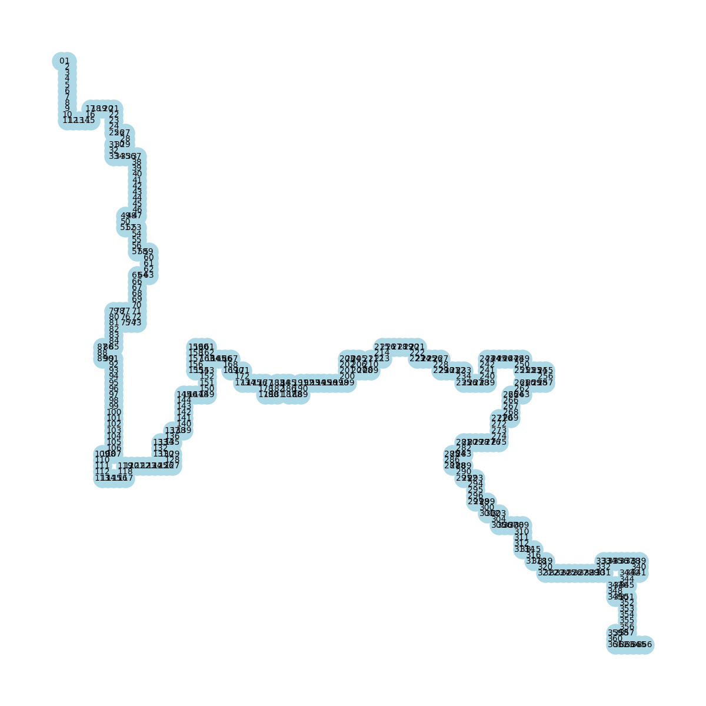

# Projeto de Resolução de Labirintos

Este projeto tem como objetivo implementar e comparar dois algoritmos de busca para resolução de labirintos: Busca em Largura (BFS) e Busca em Profundidade (DFS). Os labirintos são representados por arquivos de texto e os resultados são processados e visualizados para análise de desempenho.

Plotagem do caminho do maior labirinto.
## Estrutura do Projeto

O projeto inclui os seguintes scripts e arquivos:

- **`main.py`**: Este script é responsável por processar um único arquivo de labirinto. Para rodar a solução e passar um arquivo de cada vez, execute o `main.py`.
- **`run_all_mazes_bfs_dfs.py`**: Script para processar todos os arquivos de labirinto (`.txt`) em um diretório. Para rodar todos os arquivos de uma vez, execute este script.
- **`solvers_txt_write_json.py`**: Script para gravar os resultados dos caminhos encontrados em arquivos JSON. Certifique-se de executar este script antes de tentar plotar os resultados.
- **`plot.py`**: Este script é usado para gerar gráficos com base nos arquivos JSON gerados. Certifique-se de que o `solvers_txt_write_json.py` foi executado previamente.

## Como Executar

1. **Processar um Labirinto Específico**

   Para processar um único arquivo de labirinto, execute o seguinte comando:

   ```bash
   python main.py <caminho_para_o_arquivo_de_labirinto>
   ```
2. **Processar Todos os Arquivos em um Diretório**

    Para processar todos os arquivos .txt em um diretório, execute:

    ```bash
    python run_all_mazes_bfs_dfs.py <diretório_com_arquivos_txt>
    ```
3. **Gravar Resultados em JSON**

   Para gravar os resultados dos caminhos em arquivos JSON, execute:

  ```bash
  python solvers_txt_write_json.py
  ```

4. **Plotar Resultados**

  Após gerar os arquivos JSON, você pode plotar os resultados usando:

  ```bash
  python plot.py
  ```
  Os resultados plotados serão salvos nas pastas BFS e DFS.

## Resultados
  Os resultados plotados estão disponíveis nas pastas BFS e DFS, onde cada pasta contém gráficos representando o desempenho dos algoritmos para diferentes labirintos.

Você pode ajustar os comandos e descrições conforme a necessidade do seu projeto.
